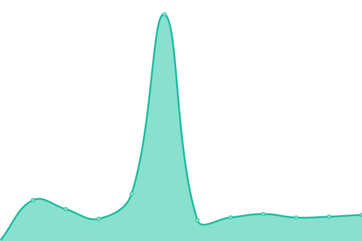
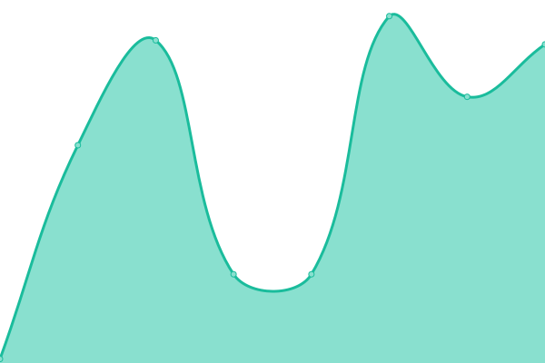

# [📈 Live Status](https://status.huskysatellitelab.com): <!--live status--> **🟧 Partial outage**

This repository contains the open-source uptime monitor and status page for [uwcubesat](https://status.huskysatellitelab.com), powered by [Upptime](https://github.com/upptime/upptime).

With [Upptime](https://upptime.js.org), you can get your own unlimited and free uptime monitor and status page, powered entirely by a GitHub repository. We use [Issues](https://github.com/uwcubesat/selfhosted-upptime/issues) as incident reports, [Actions](https://github.com/uwcubesat/selfhosted-upptime/actions) as uptime monitors, and [Pages](https://status.huskysatellitelab.com) for the status page.

<!--start: status pages-->
<!-- This summary is generated by Upptime (https://github.com/upptime/upptime) -->
<!-- Do not edit this manually, your changes will be overwritten -->
<!-- prettier-ignore -->
| URL | Status | History | Response Time | Uptime |
| --- | ------ | ------- | ------------- | ------ |
|  [Proxy](https://online.huskysatellitelab.com) | 🟩 Up | [proxy.yml](https://github.com/UWCubeSat/selfhosted-upptime/commits/HEAD/history/proxy.yml) | 

 331ms
     
 | 

<a href="https://status.huskysat.org/history/proxy">100.00%</a>
    

|  [Wiki](https://online.huskysatellitelab.com/wiki) | 🟩 Up | [wiki.yml](https://github.com/UWCubeSat/selfhosted-upptime/commits/HEAD/history/wiki.yml) | 

 8138ms
     
 | 

<a href="https://status.huskysat.org/history/wiki">48.70%</a>
    

|  [PartDB](https://online.huskysatellitelab.com/partdb) | 🟥 Down | [part-db.yml](https://github.com/UWCubeSat/selfhosted-upptime/commits/HEAD/history/part-db.yml) | 

 67ms
     
 | 

<a href="https://status.huskysat.org/history/part-db">0.00%</a>
    

|  [Keycloak](https://online.huskysatellitelab.com/keycloak/) | 🟩 Up | [keycloak.yml](https://github.com/UWCubeSat/selfhosted-upptime/commits/HEAD/history/keycloak.yml) | 

 252ms
     
 | 

<a href="https://status.huskysat.org/history/keycloak">100.00%</a>
    

<!--end: status pages-->

[**Visit our status website →**](https://status.huskysatellitelab.com)

## 📄 License

- Powered by: [Upptime](https://github.com/upptime/upptime)
- Code: [MIT](./LICENSE) © [uwcubesat](https://status.huskysatellitelab.com)
- Data in the `./history` directory: [Open Database License](https://opendatacommons.org/licenses/odbl/1-0/)
